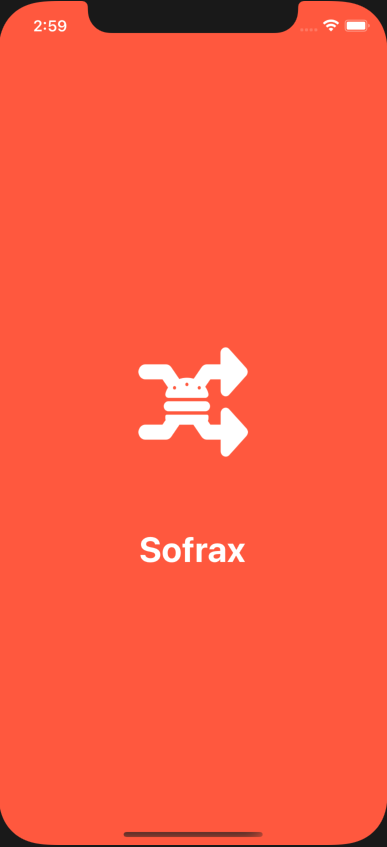
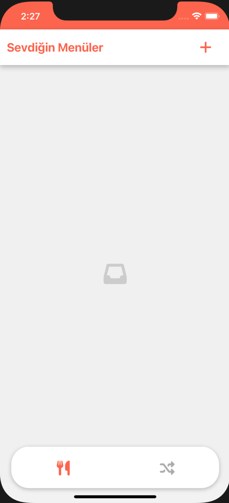
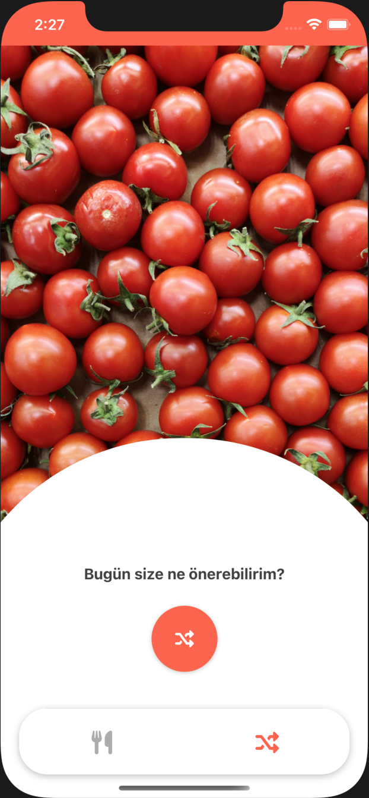
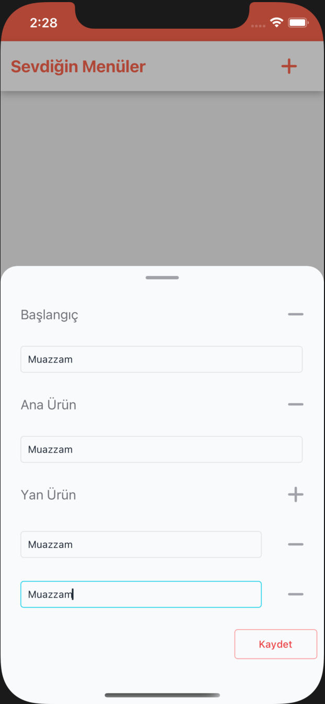
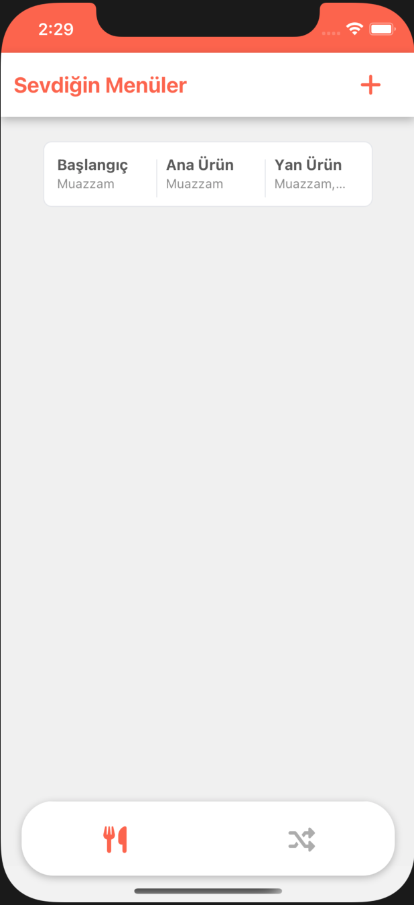
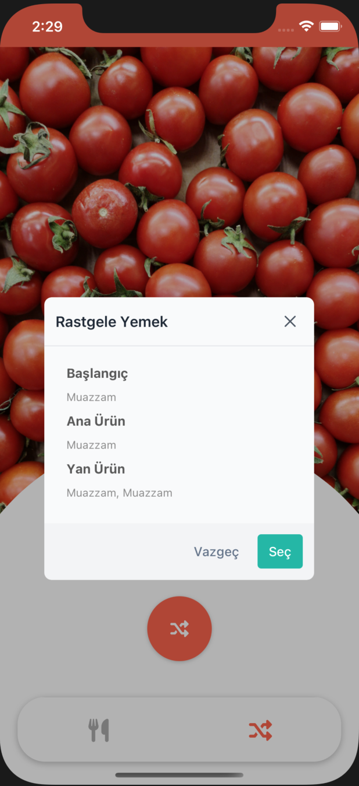
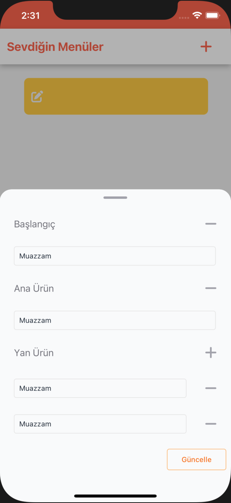

# Getting Started

### Reference Documentation

For further reference, please consider the following sections:

* Installation Environment
* Build
* Bundle Release
* Live App ScreenShots

### Guides

Download and run wherever you go!

This project uses React Native 0.67.1, React 17.0.2, NodeJs 16.13.2 and NPM 8.1.2 versions

#### Installation Environment

* Installing [Nodejs](https://nodejs.org/en/download/)
* Installing React Native CLI `npm install -g react-native`
* Installing [Android Studio](https://developer.android.com/studio/index.html)

While on Android Studio installation wizard, make sure the boxes next to all of the following items are checked:

* Android SDK
* Android SDK Platform
* Android Virtual Device

---
* Configuring ANDROID_SDK_ROOT environment variable
  
Add the following lines to your $HOME/.bash_profile or $HOME/.bashrc (if you are using zsh then ~/.zprofile or ~/.zshrc) config file:
```
  export ANDROID_SDK_ROOT=$HOME/Library/Android/sdk
  export PATH=$PATH:$ANDROID_SDK_ROOT/emulator
  export PATH=$PATH:$ANDROID_SDK_ROOT/platform-tools
```

* Download Xcode from App Store, then, install
* Installing Cocoapods `gem install cocoapods`
* Installing Xcode command line tool `xcode-select --install`
* Routing from command line tool to app `xcode-select -switch /Applications/Xcode.app`
* Installing npm dependency `cd <project-dir>; npm install`
* Installing ios dependency `cd <project-dir>/ios; pod install`

#### Build

* Running development server `npm run start`
* Running simulator for ios `npm run ios`
* Running simulator for android `npm run android`

#### Bundle Release

* Generating keystore for android
```
keytool -genkey -v -keystore release.keystore -alias <alias-name> -keyalg RSA -keysize 2048 -validity 10000
```
* Assembling release for android `./gradlew assembleRelease`
* Getting release for android
```
react-native bundle --platform android --dev false --entry-file index.js --bundle-output android/app/src/main/assets/index.android.bundle --assets-dest android/app/build/intermediates/res/merged/release/
```
* Getting release for ios
```
react-native bundle --dev false --entry-file index.js --bundle-output ios/main.jsbundle --platform ios
```

#### Live App ScreenShots

<table style="">
  <tr>
    <td></td>
    <td></td>
    <td></td>
    <td></td>
    <td></td>
  </tr>
  <tr>
    <td></td>
    <td></td>
  </tr>
</table>


